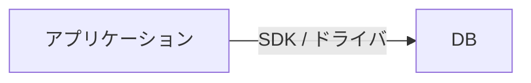
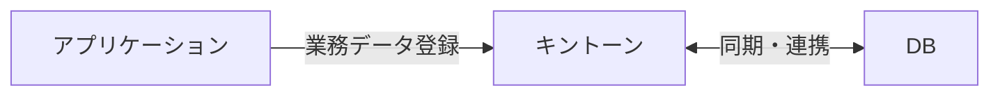

# データ永続化方式の検討

## 案A：アプリケーション→キントーン
- **特徴** アプリケーションから直接キントーンへREST連携し、業務データを即時登録。
- **利点** キントーンのUI・ワークフローをそのまま活用でき、管理コストを低く抑えられる。
- **懸念** クエリ柔軟性や集計性能はキントーン依存となり、複雑な分析には不向き。

## 案B：アプリケーション→データベース
- **特徴** RDBへ直接保存。
- **利点** 高度なクエリ・集計・外部BI連携がやりやすく、将来的な拡張性が高い。
- **懸念** 権限管理やUIを別途実装する必要があり、運用負荷が上がる可能性。

## 案C：アプリケーション→キントーン／データベースの併用
- **特徴** 基幹データをデータベースに、現場運用や承認ワークフローをキントーンに置くハイブリッド構成。
- **利点** 運用効率と分析基盤を両立でき、用途に応じた最適化が可能。
- **懸念** 二重管理を避けるための同期処理・排他制御が必要となる。

---

### 比較ポイント（参考）
- **開発コスト** 案A < 案C < 案B
- **柔軟な分析** 案B・案Cが有利
- **運用UI** 案A・案Cはキントーンをそのまま活用可能

